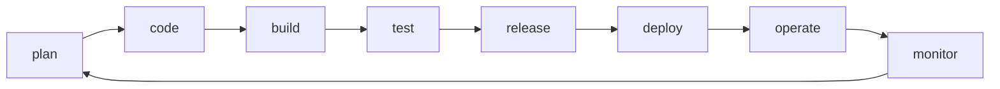

# AI Adoption Map

```meta
status: candidate
index: root
type: adoption-map
```

How this repository is built with AI, organized by the DevOps loop. The practices live one
chapter each in the usage files below; this file is the map. The tools themselves are
registered in `.devbook/tech/`, never here.

## Usage files

| File | Covers |
| --- | --- |
| `01-plan.md` | Specifying work: chapters, backlog items, and their approval |
| `02-code-test.md` | Implementing and validating a change |
| `03-build-release.md` | Getting a change through CI and into a release |
| `04-operate-monitor.md` | Running the system and feeding what it shows back into planning |

## The loop



No usage chapter has been written yet, so every stage renders empty. That is the finding,
not a gap to fill with a tool name.

## Status ladder

`candidate` → `trial` → `adopted` → `hold` → `retired`, per `devbook-ai.md`. Promote a
chapter when its **Adopted by** line says the team actually works this way, and record what
is dropped as `retired` rather than deleting it.
