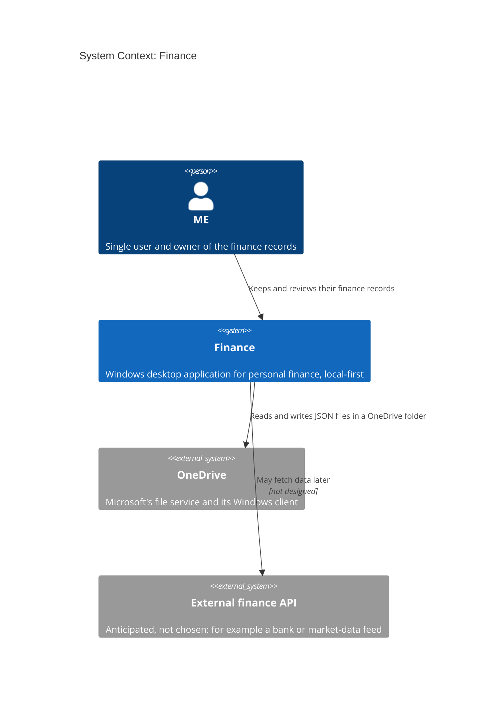

# 03. Context and Scope

```meta
status: draft
related: [.devbook/domain/context-map.md]
```

Finance's boundary is the desktop application and the data folder it owns. Everything else
is outside it.

## Business Context

```meta
status: draft
related: [.devbook/arc42/01-introduction-and-goals.md#requirements-overview, .devbook/domain/finance/context.md]
```



Finance never calls OneDrive over the network. It reads and writes a local folder, and the
OneDrive client replicates that folder on its own schedule. The external API is drawn so
the boundary is visible; nothing about it is decided.

## Technical Context

```meta
status: draft
related: [.devbook/arc42/07-deployment-view.md]
```

| Neighbour | Channel | What crosses it |
| --- | --- | --- |
| ME | Desktop window on Windows | All user interaction. |
| Local file system | Windows file APIs | The JSON files in the data folder. |
| OneDrive client | The same folder on disk | Nothing direct: the client syncs the folder independently of Finance. |
| External finance API | HTTPS, when it exists | Not designed; see [the integration seam](05-building-block-view.md#integration-seam). |

## Out of Scope

```meta
status: draft
```

Finance has no mobile app, no web release, and no IDE or chat integration. It runs no cloud
service and keeps no copy of the data outside the data folder. A browser host of the UI may
exist for testing, and [05. Building Block View](05-building-block-view.md#development-harness)
keeps it a development tool, not a second channel.
