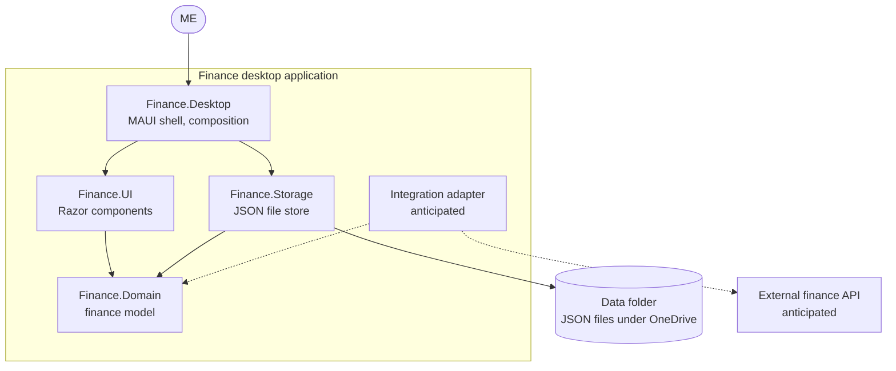
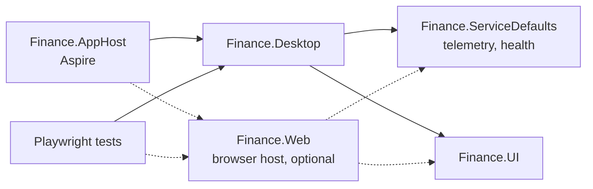

# 05. Building Block View

```meta
status: draft
related: [.devbook/arc42/04-solution-strategy.md, .devbook/domain/finance/context.md]
```

Finance is one deployable application built from a few .NET projects. The project names
below are the planned ones; no code exists yet, and the first implementation may rename them.
What the `finance` model contains is the authority of
[`.devbook/domain/finance/`](../domain/finance/context.md), so this view names the model
project without restating its contents.

## Level 1

```meta
status: draft
related: [.devbook/arc42/03-context-and-scope.md#business-context, .devbook/arc42/adr/desktop-stack.md, .devbook/arc42/adr/storage.md]
```



| Block | Responsibility |
| --- | --- |
| `Finance.Desktop` | The .NET MAUI Blazor Hybrid executable. It opens the window, hosts WebView2, and wires the other projects together. |
| `Finance.UI` | A Razor class library with every page and component. It holds no file access, so another host can render it. |
| `Finance.Domain` | The `finance` model and the store interface it needs. It references no UI, file, or network library. |
| `Finance.Storage` | Implements the store interface against JSON files in the data folder, per [the storage record](adr/storage.md). |
| Integration adapter | Not built. See [Integration Seam](#integration-seam). |

The model sits at the centre and depends on nothing else in Finance. Storage depends on the
model, never the reverse, so the file format can change without touching a rule.

## Development Harness

```meta
status: draft
related: [.devbook/arc42/07-deployment-view.md#development, .devbook/arc42/08-crosscutting-concepts.md#testability]
```



These projects exist only for development and never ship to the user.

- `Finance.AppHost` is the Aspire entry point that starts the application and its dashboard.
- `Finance.ServiceDefaults` adds OpenTelemetry and health checks to every project that references it.
- `Finance.Web` is optional. It hosts `Finance.UI` in an ordinary browser over a throwaway data folder, so Playwright can run without the MAUI shell. It is a test harness, not a second channel, and whether to build it is open in [11. Risks and Technical Debt](11-risks-and-technical-debt.md#open-questions).

## Integration Seam

```meta
status: draft
related: [.devbook/arc42/11-risks-and-technical-debt.md#open-questions, .devbook/arc42/08-crosscutting-concepts.md#external-integration]
```

Finance will probably fetch data from an external API one day, such as bank transactions or
market prices. Nothing about that API is chosen. The architecture reserves only where it
attaches: a separate adapter project that translates the external data into the `finance`
model's own terms. The adapter acts as an anti-corruption layer, so no external type reaches
`Finance.Domain`.

The adapter, its trigger, and how it stores credentials get designed when a concrete API is
picked. That choice will need its own decision record.
