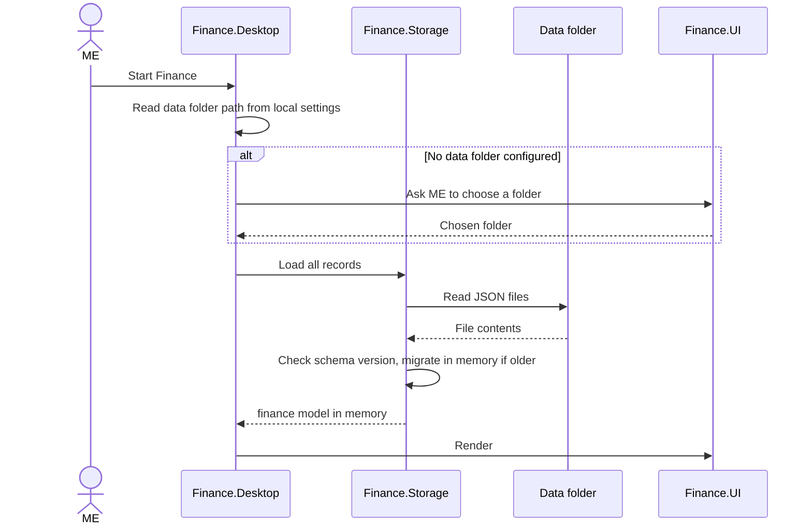
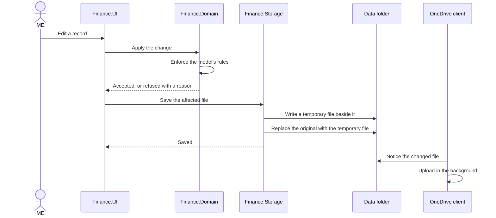
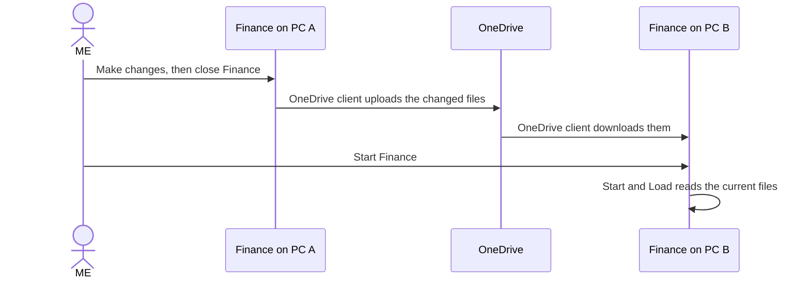
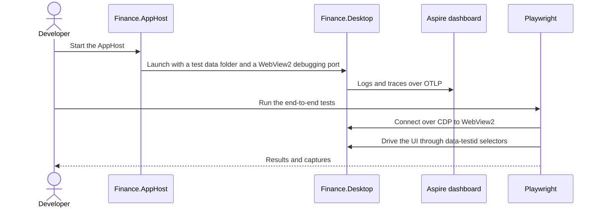

# 06. Runtime View

```meta
status: draft
related: [.devbook/arc42/05-building-block-view.md]
```

Four scenarios show how the building blocks from chapter 5 work together at run time.

## Start and Load

```meta
status: draft
related: [.devbook/arc42/05-building-block-view.md#level-1, .devbook/arc42/08-crosscutting-concepts.md#configuration]
```



Finance loads every record into memory at start. A single person's finance records stay
small enough for that, and it keeps every later read local and instant. A file with a newer
schema version than the application knows stops the load with a message, so an old build
never overwrites data written by a newer one.

## Save a Change

```meta
status: draft
related: [.devbook/arc42/adr/storage.md, .devbook/arc42/08-crosscutting-concepts.md#persistence]
```



The model refuses an invalid change before anything touches disk. The replace step is what
makes a write atomic: a crash leaves either the old file or the new one, never half of each.
Finance does not wait for OneDrive, and works the same when OneDrive is offline or paused.

## Continue on Another PC

```meta
status: draft
related: [.devbook/arc42/07-deployment-view.md#production, .devbook/arc42/11-risks-and-technical-debt.md#risks]
```



The hand-over works when Finance runs on one PC at a time and OneDrive has finished syncing.
Running it on two PCs at once, or starting before a download completes, can produce an
OneDrive conflict copy or stale data. [11. Risks and Technical Debt](11-risks-and-technical-debt.md#risks)
tracks that.

## Development Run with Playwright

```meta
status: draft
related: [.devbook/arc42/07-deployment-view.md#development, .devbook/arc42/adr/desktop-stack.md]
```



OTLP is the OpenTelemetry protocol, and CDP is the Chrome DevTools Protocol that WebView2
exposes. A test run points Finance at a throwaway data folder, never at the real OneDrive one.
