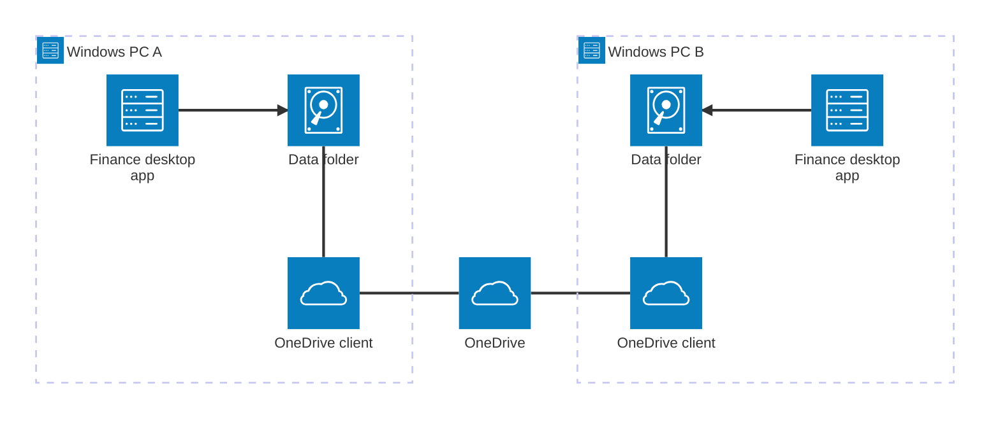
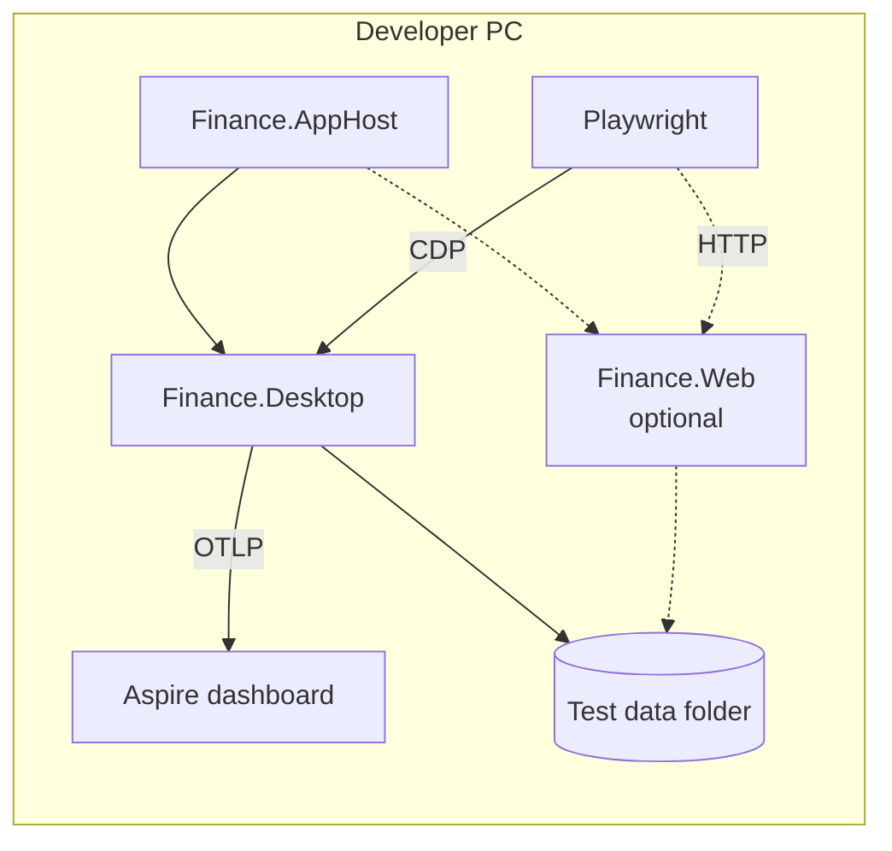

# 07. Deployment View

```meta
status: draft
related: [.devbook/arc42/05-building-block-view.md]
```

Finance has two environments: the user's own Windows PCs, and the developer's machine. No
part of Finance is deployed to a server or a cloud subscription.

## Production

```meta
status: draft
related: [.devbook/arc42/adr/storage.md, .devbook/arc42/06-runtime-view.md#continue-on-another-pc]
```



| Node | Runs | Notes |
| --- | --- | --- |
| Windows PC | `Finance.Desktop` and its libraries | One installation per PC. How it is packaged and installed is open, see [11](11-risks-and-technical-debt.md#open-questions). |
| Data folder | The JSON files | A folder the user picks under their OneDrive. Its layout is in [08](08-crosscutting-concepts.md#persistence). |
| OneDrive client | Microsoft's sync client | Replicates the data folder. Finance neither starts nor controls it. |
| OneDrive | Microsoft's cloud storage | Holds the replicated copy. It is the user's own account, not a Finance resource. |

A second PC is optional. With one PC, OneDrive still gives an off-machine copy and its file
version history. The AppHost and the Aspire dashboard are absent in production, so the
telemetry ServiceDefaults wires has no collector to send to.

## Development

```meta
status: draft
related: [.devbook/arc42/05-building-block-view.md#development-harness, .devbook/arc42/06-runtime-view.md#development-run-with-playwright]
```



Everything runs on the developer's PC. The AppHost starts the application against a test data
folder outside OneDrive, so development and test runs never touch the real records. CI runs the
same projects on a Windows runner; the exact CI workflow is not designed yet.
