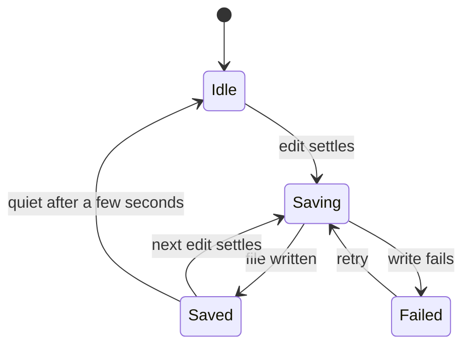

# Interaction Guidelines

```meta
related: [.devbook/design/design-principles.md#no-save-buttons, .devbook/design/accessibility.md, .devbook/arc42/08-crosscutting-concepts.md#persistence]
```

> Binding interaction rules for Finance: auto-save, undo, reordering with keyboard
> equivalents, entering amounts, feedback, motion, focus and selection, and the empty,
> loading, and error states. Adapted from Backlog's `interaction-guidelines.md`, which drew
> on the JSdotNet design style guide. Token names are declared in `color-scheme.md` and
> `typography-and-layout.md`.

## Auto-Save

```meta
related: [.devbook/design/design-principles.md#no-save-buttons, .devbook/arc42/08-crosscutting-concepts.md#persistence]
```

There is no manual save anywhere in Finance. Every edit is written to the user's data folder
automatically.



A text edit settles after its debounce. A discrete change settles at once. The indicator
shows each state in the vocabulary below.

### Save Timing and Debounce

```meta
```

| Rule | Requirement |
|---|---|
| No save affordance | There MUST NOT be a Save button, menu item, or save-only keyboard gesture. |
| Text debounce | Continuous text edits MUST save on a debounce of 500 to 1000 ms after the last keystroke. The default is 750 ms. |
| Blur flush | A pending save MUST be written at once on blur, on navigation away, and when the window closes. |
| Discrete changes | A discrete change, such as a reorder, a toggle, or a picked value, MUST save at once with no debounce. |
| No stuck state | A save that has not finished within about 5 seconds MUST move to `Failed` with a retry, rather than show `Saving` forever. |
| Order | The UI updates first, then the file is written. Editing MUST NOT wait for the write. |

### Optimistic UI

```meta
```

| Rule | Requirement |
|---|---|
| Immediate | The UI MUST show the change at once, before the file write completes. |
| Non-blocking | A save MUST NOT block typing, navigation, or further edits. |
| Failure | If a write fails, the change MUST be visibly flagged or rolled back, never dropped quietly, and the indicator MUST show `Failed`. |

### Save-State Indicator Vocabulary

```meta
```

One indicator, always visible, says what has been written. The vocabulary is fixed.

| State | Label | Icon | Colour | Meaning |
|---|---|---|---|---|
| Idle | (nothing shown) | none | none | No edit in flight. |
| Saving | `Saving…` | `loader-2`, static under reduced motion | `color-text-secondary` | A write is in progress. |
| Saved | `Saved` | `check-circle` | `color-text-secondary` | Every change is in the data folder. |
| Failed | `Couldn't save` and a Retry control | `x-circle` | `color-error` surface | A write failed. The change is still on screen. |

Rules:

- The indicator MUST be visible without user action, and MUST NOT be a button that saves.
- `Saved` is quiet. It MUST NOT nag with a green banner, and it settles back to Idle.
- Backlog's `Offline` and `Conflict` states are not carried over. Finance has no sync of its
  own, so it has nothing to be offline from and no conflict to report.
- Announcements for each state are in `accessibility.md#save-state-announcements`.

### Undo and History

```meta
```

| Rule | Requirement |
|---|---|
| Undo available | With no save gate, undo (Ctrl+Z) and redo (Ctrl+Y or Ctrl+Shift+Z) MUST be available for edits and reorders. |
| Single steps | A reorder MUST be one undo step. Rapid keystrokes SHOULD coalesce into sensible steps. |
| Destructive actions | Deleting a record MUST be undoable, at least for the session, and the toast that confirms it MUST offer Undo. A delete with no undo MUST ask for confirmation first. |
| Longer history | Browsing older versions is a product feature. `[TODO: clarify]` Whether Finance offers it. Session-level undo is the minimum. |

### Changes from Another PC

```meta
status: draft
related: [.devbook/arc42/08-crosscutting-concepts.md#persistence]
```

OneDrive can replace a data file while Finance is open, when the user edited on another PC.
`[TODO: clarify]` How Finance shows that. The architecture has not decided how records split
across files, or how Finance detects a file changed under it. Until it has, the design rule
is the one below.

| Rule | Requirement |
|---|---|
| Never silent | When Finance reloads a record because its file changed on disk, the user MUST be told in a passive notice, never by a blocking dialog. |
| No lost edit | An unsaved local edit MUST NOT be overwritten without the user seeing it. |

## Drag-and-Drop Reordering

```meta
related: [.devbook/design/accessibility.md#keyboard-navigation, .devbook/design/design-principles.md#keyboard-first]
```

Where Finance lets the user order items in a list, the gesture follows these rules. Every
drag has a keyboard equivalent.

### Drag Affordances

```meta
```

| Rule | Requirement |
|---|---|
| Visible handle | Each reorderable row MUST expose a drag handle, the `grip-vertical` icon at `icon-md`. On dense rows the handle MAY appear on hover or focus, but MUST be reachable by keyboard. |
| Cursor | A pointer over a handle shows a grab cursor, and grabbing while dragging. |
| Lift | On drag start, the item lifts with `shadow-lg` and a `color-background-alt` tint. |
| Handle target | The handle MUST meet the 44 × 44 px target. |

### Drop Indicators

```meta
```

| Rule | Requirement |
|---|---|
| Insertion line | During a drag, an insertion line MUST show the exact drop position, drawn in `color-primary` at `border-width-2`. |
| Invalid targets | An invalid target MUST show a not-allowed cursor and no insertion line. |
| Row-wide targets | While a drag runs, each row MUST expose a drop target across its full width, split into a "before" half and an "after" half. The handle starts the drag, and the whole row catches the drop. |

### Keyboard-Accessible Reordering

```meta
```

Drag-and-drop alone is not accessible, so a keyboard path is mandatory.

| Rule | Requirement |
|---|---|
| Grab and move | Focus the handle or row and press Space or Enter to pick it up, Arrow Up or Down to move it, Space or Enter to drop, and Escape to cancel. |
| Direct moves | Alt+Arrow Up and Alt+Arrow Down move the focused row one place without picking it up. Move to top and Move to bottom are also in the row's context menu. |
| Announcements | Every keyboard move MUST announce the new position through a live region. See `accessibility.md#reorder-announcements`. |
| Focus | After a keyboard move, focus MUST stay on the moved row. |
| Parity | Anything a drag can do, the keyboard MUST be able to do. |

### Autoscroll and Saving

```meta
```

| Rule | Requirement |
|---|---|
| Edge autoscroll | Dragging near the top or bottom edge of a scrollable list MUST scroll it toward that edge at a bounded speed. |
| Keyboard scroll | A keyboard move MUST keep the moved row in view. |
| Saves at once | A finished reorder is a discrete change and MUST save immediately. |
| Failure | If the save fails, the order MUST visibly revert and the indicator MUST show `Failed`. |

## Entering Amounts

```meta
status: draft
related: [.devbook/design/typography-and-layout.md#amounts, .devbook/design/accessibility.md#amount-announcements]
```

An amount field accepts what a person types naturally and shows the result in the one
amount format.

| Rule | Requirement |
|---|---|
| Plain text input | An amount field MUST be a text input with `inputmode="decimal"`, not a number input with spinner buttons. Spinners change money by accident on a scroll. |
| Both separators | The field MUST accept both a comma and a full stop as the decimal separator, and ignore thousands separators and spaces. |
| Format on blur | On blur, the field MUST reformat its value to the format in `typography-and-layout.md#amounts`. While focused, it MUST NOT reformat under the caret. |
| Right-aligned | The value in an amount field MUST be right-aligned and use `font-variant-amount`. |
| Direction is explicit | Where an amount has a direction, the field MUST make it a separate, labelled choice (money in or money out), not a minus sign the user must remember to type. |
| Validation | An invalid value MUST show an inline error below the field, in `color-error-text` with the `x-circle` icon and text, linked through `aria-describedby`. The last valid value stays saved. |
| Precision | The field MUST NOT accept more than two decimals. It MUST NOT round a typed value silently. It refuses the third decimal and says why. |

## Feedback and Toasts

```meta
```

| Rule | Requirement |
|---|---|
| Non-blocking | Toasts are brief, non-blocking, and dismiss themselves. They MUST NOT take keyboard focus. |
| Placement | Toasts appear bottom-right, stacked with `spacing-sm`. At most three show at once, and the rest queue. |
| Roles | Success and info toasts use `role="status"`. Warning and error toasts use `role="alert"`. |
| Dismiss | The dismiss control MUST have an accessible name, "Dismiss notification". |
| No save toasts | Routine saves MUST NOT raise toasts. The save-state indicator covers them. Toasts are for failures and notable events. |
| Inline confirmation | For a small edit, prefer a brief inline confirmation over a toast. |

## Motion and Reduced Motion

```meta
related: [.devbook/design/typography-and-layout.md#shadows-and-elevation, .devbook/design/accessibility.md#reduced-motion]
```

Motion is for a purpose only: to show a change of state, direct attention, or give feedback.
Use the fixed tokens.

| Duration token | Value | Easing token | Value |
|---|---|---|---|
| `transition-instant` | 0ms | `ease-linear` | linear |
| `transition-fast` | 150ms | `ease-in` | cubic-bezier(0.4,0,1,1) |
| `transition-base` | 250ms | `ease-out` | cubic-bezier(0,0,0.2,1) |
| `transition-slow` | 350ms | `ease-in-out` | cubic-bezier(0.4,0,0.2,1) |
| `transition-page` | 500ms | `ease-bounce` | cubic-bezier(0.34,1.56,0.64,1) |

| Interaction | Duration | Easing |
|---|---|---|
| Hover, focus ring | `transition-fast` | `ease-in-out` |
| Drag lift, card hover | `transition-base` | `ease-in-out` |
| Drop settle | `transition-base` | `ease-out` |
| Dropdown open | `transition-base` | `ease-out` |
| Modal or drawer enter | `transition-slow` | `ease-out` |
| Toast or save-state enter | `transition-slow` | `ease-out` |
| Saved confirmation | `transition-base` | `ease-out` |

Rules:

- Default to `ease-in-out`. Use `ease-out` for entering elements and `ease-in` for exiting
  ones. `ease-bounce` is for positive confirmations only, never errors.
- The saved confirmation uses `ease-out`, not `ease-bounce`. Saves happen constantly and
  unprompted, and a bounce on each one is too much movement. This is Backlog's recorded
  deviation from the style guide, kept here.
- An amount MUST NOT animate its digits, such as counting up to its value. A figure that is
  moving cannot be read, and it is the one thing on screen that must be exact.
- Animate `transform` and `opacity`, never layout properties.
- Under reduced motion, follow `accessibility.md#reduced-motion`.

## Focus and Selection

```meta
related: [.devbook/design/accessibility.md#focus-visibility, .devbook/design/design-principles.md#low-chrome-content-first]
```

| Rule | Requirement |
|---|---|
| Visible focus | Keyboard focus MUST use a `color-border-focus` outline at `border-width-2` with a 2 px offset. Use `outline`, which survives Windows contrast themes. |
| Logical order | Focus order MUST follow reading order. Modals and drawers trap focus and return it to their trigger on close. |
| Selection differs from focus | A selected row uses a `color-primary-subtle` background and a `color-primary` stripe at `border-width-4` on its leading edge. Selection MUST look different from hover and from focus. |
| Multi-select | Bulk selection shows a bar with a live count ("3 selected") and a control to clear it. "Select all" shows the indeterminate state for a partial selection. |
| Entering multi-select | A list MUST NOT show selection checkboxes until the user asks for them with a Select toggle. Hover or focus alone is not asking. |
| Leaving multi-select | Escape leaves selection mode from the toggle, the bulk bar, or any row, unless a control in focus owns Escape for something of its own. |

## Group Shape Says Cardinality

```meta
related: [.devbook/design/interaction-guidelines.md#focus-and-selection]
```

A group of pressable options in the chrome is drawn in one of two shapes. The shape says how
many options can be on at once, before the user presses anything.

| Rule | Requirement |
|---|---|
| Fused means several | A group whose options can be on together MUST draw its members flush inside one border, with hairlines between them. |
| Loose means one | A group whose options are exclusive MUST draw its members as separate bordered controls with a gap between them. |
| Alone means on or off | A control that is simply on or off and belongs to no set MUST stand alone, outside any fused group. |
| Still one group | A loose group is still one `role="group"` with one label and one tab sequence. Only the drawing changes. |
| Selected state | A fused option shows its selected state as an underline on the shared bottom edge. A loose option shows it on its own border. Neither relies on colour alone. |

## Empty, Loading, and Error States

```meta
```

### Empty States

```meta
```

| Rule | Requirement |
|---|---|
| Structure | An `icon-xl` illustration, a one-line explanation, and a primary action when the user can act. |
| Variants | First use (an action to create), no results (Clear filters), error (Try again), and complete (no action needed). |
| Title | The title is a short fragment with no full stop, such as "No records yet". A full sentence goes in the description. |
| Copy | Calm, plain copy with no dead ends. |

### Loading States

```meta
```

| Rule | Requirement |
|---|---|
| Local is fast | The data is local, so most views SHOULD render at once. A loading state is the exception. |
| Skeletons | Use content-shaped skeletons for lists, cards, and tables. They pulse every 2 seconds, stop under reduced motion, and fall back to an error after about 10 seconds. |
| Spinner | Use a spinner for an action the user started, never as a placeholder where a skeleton fits. |
| Refresh | When refreshing a view that already shows data, keep the data visible and show an `icon-sm` spinner in the header. |
| No placeholder amounts | While loading, an amount MUST show a skeleton, never `€ 0,00`. A zero that is really "not loaded" is a wrong figure. |

### Error States

```meta
```

| Level | Scope | Pattern |
|---|---|---|
| Page | The whole view is unusable | A full-page error with Retry and a way back. |
| Section | One part fails | An inline error card in that section. |
| Action | An action fails | An error toast, and the control returns to a state where the user can retry. |
| Field | Validation | An inline error below the field, linked through `aria-describedby`, with colour, text, and an icon. |
| Unreadable file | A data file cannot be read | A page or section error that names the file and says the data is untouched. Finance MUST NOT overwrite a file it could not read. |
