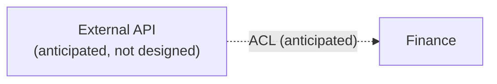

# Finance

```meta
status: draft
type: context-map
```

> `domain/`'s root document: the bounded contexts this repository models and how they relate.

Finance is a personal finance app for one person. It runs as a single desktop app and keeps
its data as files in that person's OneDrive folder. The whole domain is one bounded context,
so this map has one context and no relationships between contexts.

## Finance

```meta
status: draft
type: bounded-context
related: [.devbook/domain/finance/context.md]
```

Finance keeps the record of one person's own money and lets that person work with it. It is
the only bounded context in the repository. How it ships is not decided in this map yet.

## Subdomain landscape

| Subdomain | Classification | Bounded context |
|---|---|---|
| Personal finance | Core | Finance |

Personal finance is the reason the app exists, so it is the core subdomain. No supporting or
generic subdomain has been carved out. Storing files in OneDrive is a technical choice and is
recorded in `arc42/`, not here.

## Context map



The map has one bounded context. The dashed edge marks an external API that the app is
expected to use at some point. Nobody has chosen which API, or what Finance would take from
it, so the relationship is anticipated and not designed.

## Published languages

None. Finance has no other context to publish to, and nothing outside the app consumes its
data.

## Strategic rules

- Finance stays one bounded context until a part of the domain needs its own language and
  its own rules. Splitting it is a decision worth an `arc42/adr/` record.
- When an external API arrives, its data enters Finance through an anti-corruption layer
  (ACL). The ACL translates the provider's terms into Finance's own terms, so a change of
  provider does not change the model.
